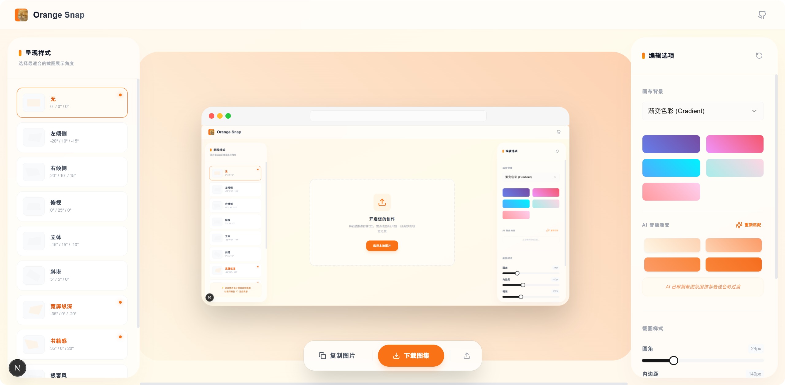
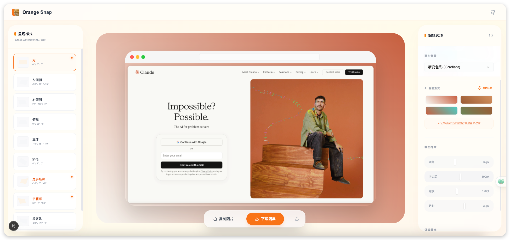

# Orange-Snap 0.2.0

简洁、高级、专业的截图美化工作室，让你的截图瞬间拥有电影感 ✨

Orange-Snap 已经从一个基础工具进化为了全屏工作台级的设计器，支持 3D 透视变换与 AI 智能配色，实现 100% 的“所见即所得”效果。




## ✨ 特点

Orange-Snap v2 带来了跨代级的提升：

- 🎨 **高级弥散渐变 (Mesh Gradient)**：内置动态色彩气泡与电影级噪点纹理，轻松复刻顶级设计风格。
- 🪄 **3D 视角转换**：内置 10 种极致 3D 呈现预设（等距、倾斜、立体等），采用原生 CSS 3D 驱动，比例守恒不失真。
- 🤖 **AI 自动智能提取**：
  - **上传即提取**：文件选定瞬间自动分析主色调与渐变配色。
  - **持久化建议**：提取结果全程保存，支持一键应用到纯色、渐变或弥散背景。
- 🖼️ **旗舰渲染引擎 (SnapDOM)**：
  - **100% 还原**：预览看到的，就是导出的。彻底解决 Canvas 模拟失真问题。
  - **精细导出**：支持 2x 采样高保真下载与剪切板复制。
- 📏 **空间感设计**：支持高达 **400px** 的超级内边距，配合 **48px 全局大圆角**，大方且高级。
- 📋 **高效率操作**：支持拖放、粘贴、快捷键 (**Ctrl+C / Cmd+C**) 以及实时通知反馈。
- 🎯 **工作室布局**：全屏 Workbench 布局，沉浸式设计体验。

## 🔧 环境变量配置

为了使用 AI 颜色提取功能，您需要配置以下环境变量：

1. 在项目根目录创建 `.env.local` 文件
2. 添加以下配置：

```env
# OpenAI/Gemini Configuration
OPENAI_API_KEY=your_openai_api_key_here
OPENAI_BASE_URL=https://api.openai.com/v1
AI_MODEL=gemini-2.0-flash
```

注意：

- `OPENAI_API_KEY` 是必需的，用于访问 Vision API。
- `AI_MODEL` 默认为 `gemini-2.0-flash`。

## 🚀 极致性能

项目已全面迁移至 **VoidZero** 工具链：

- **Linter**: 使用 [Oxlint](https://oxlint.rs) 替代 ESLint，代码检查提速 100 倍。
- **Framework**: 构建于 [Next.js 15.5.9](https://nextjs.org) 尖端版本。

## 🏗️ 快速开始

```bash
# 安装依赖
pnpm install

# 启动开发服务器
pnpm run dev

# 构建生产版本
pnpm run build
pnpm start
```
